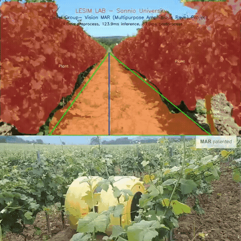

# MAR Rover — vision-guided crop-row navigation

> A computer-vision prototype for helping an amphibious rover understand the space between orchard rows.

[](assets/mar-rover-demo.mp4)

This is a portfolio snapshot of my work with **SeTeL** on the MAR Rover: a multipurpose amphibious vehicle designed for environments that do not fit neatly into a road map. In this case, the goal was straightforward to describe and harder to solve well—give the rover enough visual context to keep to the soil path while respecting plants and trunks around it.

The model is a YOLOv8 segmentation model trained to separate four scene elements: **plant**, **sky**, **soil**, and **trunk**. That segmentation can become a practical signal for estimating the drivable corridor and flagging vegetation that the vehicle should avoid.

**[Watch the original LinkedIn demo and project story →](https://www.linkedin.com/feed/update/urn:li:activity:7114639932651937792/)**

## What is in this repository

- A small, repeatable training entry point for the YOLOv8 segmentation workflow.
- A command-line inference script for images and videos; results are written to disk rather than opened in a GUI.
- Image-space crop-row guidance that turns a soil mask into a visual centreline and lateral offset.
- A 63-second field demo from the project; the animated preview above links to the full MP4.
- The dataset configuration and notes needed to reproduce the class setup.

The committed demo is meant to show the work, not to claim a production-ready autonomy stack. Vehicle control, sensor fusion, obstacle policy, and real-world safety validation are deliberately outside this repository.

## Quick start

Python 3.10+ is recommended.

```bash
python -m venv .venv
# Windows: .venv\Scripts\activate
# macOS/Linux: source .venv/bin/activate
pip install -r requirements.txt

python src/infer.py \
  --weights path/to/your/last.pt \
  --source assets/demo-frame.jpg
```

For video inference, point `--source` at a local video. Add `--stride 2` (or higher) when a lower processing rate is more appropriate for the hardware.

Annotated output is saved to `outputs/segmentation/`.
### From segmentation to a visual route

The original notebook runs semantic segmentation only. `src/row_guidance.py` keeps the ground-connected soil region, follows its centre through several horizontal scan lines, and returns a centreline plus a normalised lateral offset from the image centre.

```bash
python src/guide_image.py \
  --weights path/to/your/last.pt \
  --source assets/demo-frame.jpg \
  --output outputs/row-guidance.jpg
```

This is **visual guidance**, not a motor-control loop. Turning this result into safe rover steering still needs camera calibration, a coordinate transform, sensor fusion, a speed-aware controller, and a hardware-specific safety interface.

## Dataset and training

The original Roboflow YOLOv8 export contains 193 annotated images: 183 for training and 10 for validation. Its documented licence is MIT. To keep this repository focused and lightweight, the raw dataset and trained checkpoints are intentionally not committed.

1. Download or place the YOLOv8 export at `STL2v1yolov8/`.
2. Confirm that `configs/stl2.yaml` points to that directory.
3. Train a baseline:

```bash
python src/train.py --data configs/stl2.yaml --model yolov8n-seg.pt --epochs 100
```

The older `main.ipynb` is retained as the original exploratory notebook. The scripts in `src/` are the maintained way to run the project.

## Repository layout

```text
assets/          Demo video and README preview
configs/         Dataset configuration
src/             Training, inference, and image-space guidance entry points
main.ipynb       Original exploration notebook
```

## Notes on responsible use

This prototype is for research and portfolio purposes. A segmentation prediction is not, by itself, a safe navigation decision. Any deployment near people, crops, water, or machinery needs calibrated sensors, independent safeguards, field testing, and a clear human-override strategy.

## Acknowledgements

Built in collaboration with the team at [SeTeL](https://www.setelgroup.com/) for the MAR Rover project. The public project context and field demo were originally shared in [this LinkedIn post](https://www.linkedin.com/feed/update/urn:li:activity:7114639932651937792/).

`assets/mar-rover-demo.mp4`, its animated preview, and its cover image are project media from that post, shared here with SeTeL's permission.
